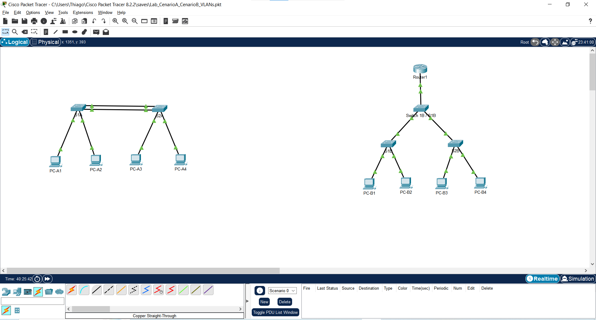
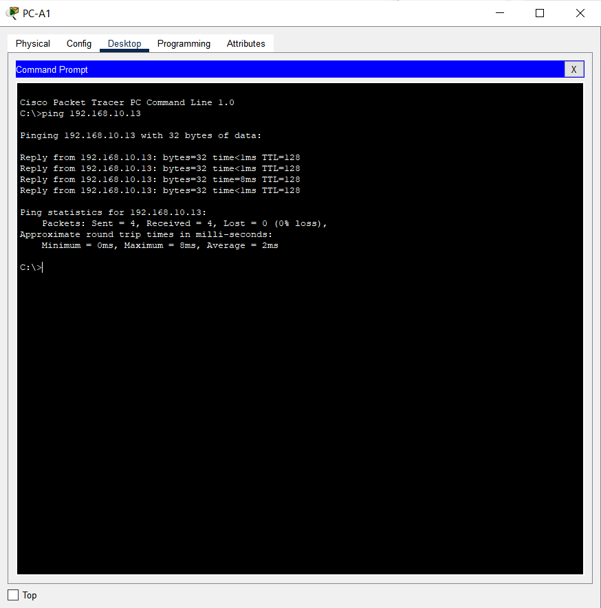
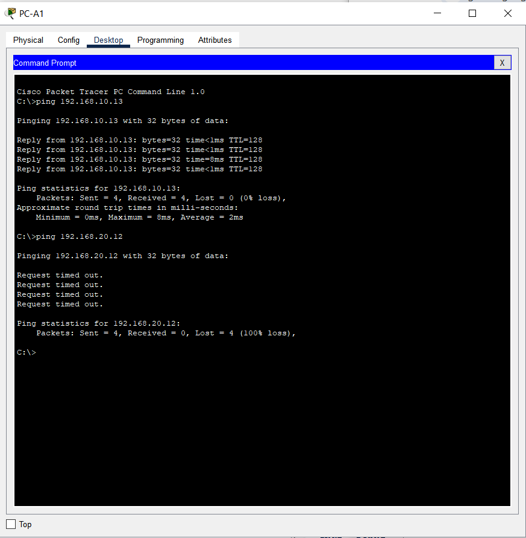
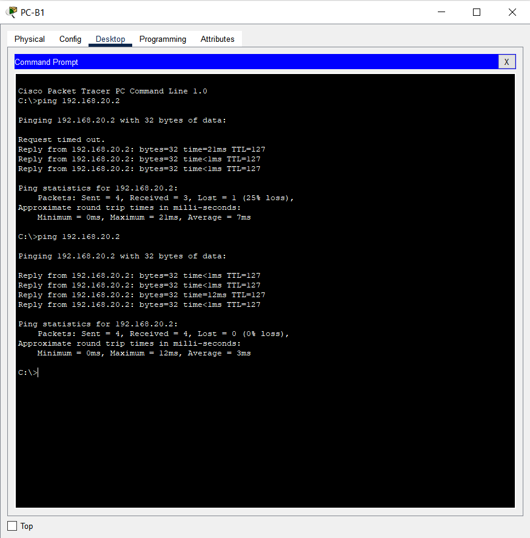

# Laboratório Prático: VLANs, Enlaces Trunk e Roteamento Inter-VLAN (Router-on-a-Stick)

## 📌 Descrição do Projeto
Este projeto foi desenvolvido no Cisco Packet Tracer para demonstrar e comparar duas arquiteturas de segmentação de redes locais:
1. **Cenário A:** Segmentação por VLANs utilizando enlaces de acesso dedicados por porta (sem enlace Trunk e sem roteamento entre VLANs).
2. **Cenário B:** Segmentação avançada por VLANs com tronco IEEE 802.1Q, Roteamento Inter-VLAN (*Router-on-a-Stick*) e distribuição dinâmica de IP via **Servidor DHCP** integrado no roteador Cisco.

---

## 🛠️ Tecnologias e Conceitos Utilizados
* **Cisco Packet Tracer 8.x**
* **Switches e Roteadores Cisco IOS**
* **VLANs (Virtual Local Area Networks):** Isolamento de domínios de broadcast (VLAN 10 - Vendas e VLAN 20 - RH).
* **Trunking (IEEE 802.1Q):** Encapsulamento e sinalização de tags em enlaces tronco.
* **Router-on-a-Stick (ROAS):** Configuração de subinterfaces e gateways padrão para comunicação entre sub-redes.
* **DHCP Service:** Configuração de múltiplos pools de IP dinâmicos em roteador Cisco.

---

## 📐 Topologia e Arquitetura

### Cenário A (Acesso Dedicado / Sem Roteamento)
Como o Cenário A não possui dispositivo de camada 3 (roteador) para atuar como Gateway ou Servidor DHCP, a atribuição de endereços é feita de forma estática em cada host.

* **Tabela de Endereçamento Estático:**
  * **PC-A1** (conectado ao `S1A` na VLAN 10): IP `192.168.10.11` | Máscara `255.255.255.0` | Gateway: *(em branco)*
  * **PC-A2** (conectado ao `S1A` na VLAN 20): IP `192.168.20.12` | Máscara `255.255.255.0` | Gateway: *(em branco)*
  * **PC-A3** (conectado ao `S2A` na VLAN 10): IP `192.168.10.13` | Máscara `255.255.255.0` | Gateway: *(em branco)*
  * **PC-A4** (conectado ao `S2A` na VLAN 20): IP `192.168.20.14` | Máscara `255.255.255.0` | Gateway: *(em branco)*
* **Comportamento:** A comunicação ocorre exclusivamente dentro da mesma VLAN através dos cabos de acesso dedicados entre os switches `S1A` e `S2A`. Não há comunicação entre a VLAN 10 e a VLAN 20 por ausência de roteamento.

### Cenário B (Trunk + Router-on-a-Stick + DHCP)
* **Subinterface g0/0/0.10:** Gateway `192.168.10.1` (VLAN 10)
* **Subinterface g0/0/0.20:** Gateway `192.168.20.1` (VLAN 20)
* **Comportamento:** Enlace tronco 802.1Q entre os switches `S1B` e `S2B` consolidando todo o tráfego. O `Router1` provê os IPs dinamicamente via DHCP para ambas as sub-redes e realiza o roteamento de pacotes entre VLANs distintas.

---

## 🧪 Validação dos Testes de Conectividade

### 1. Comunicação Intra-VLAN - Cenário A (Mesma VLAN)
Teste realizado a partir do **PC-A1** disparando pacotes ICMP para o **PC-A3** (`ping 192.168.10.13`).
* **Resultado:** **Sucesso** (mesma VLAN 10, atravessando o cabo de acesso dedicado entre `S1A` e `S2A`).

### 2. Isolamento Inter-VLAN - Cenário A (Sem Roteador)
Teste realizado a partir do **PC-A1** disparando pacotes ICMP para o **PC-A2** (`ping 192.168.20.12`).
* **Resultado:** **Falha/Timeout** (VLANs separadas e isoladas sem roteador no Cenário A).

### 3. Roteamento Inter-VLAN - Cenário B (Com Router-on-a-Stick)
Teste realizado no **PC-B1** (VLAN 10 | IP `192.168.10.2`) disparando pacotes ICMP para o **PC-B2** (VLAN 20 | IP `192.168.20.2`).
* **Resultado:** **Sucesso**. Demonstra a comunicação entre dispositivos de VLANs distintas através do roteamento via subinterfaces no `Router1`. Nota-se a perda inicial do 1º pacote devido à resolução de endereço via protocolo **ARP**, seguida de 100% de êxito nos pacotes subsequentes.

---

## 📁 Como executar o projeto
1. Faça o download do arquivo `Lab_VLANs_InterVLAN_RouterOnAStick.pkt` localizado neste repositório.
2. Abra o arquivo no **Cisco Packet Tracer**.
3. Execute os testes no *Command Prompt* dos PCs ou acompanhe a passagem dos quadros no modo de simulação.
